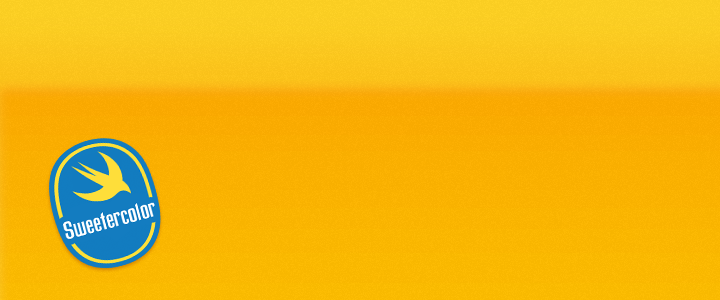
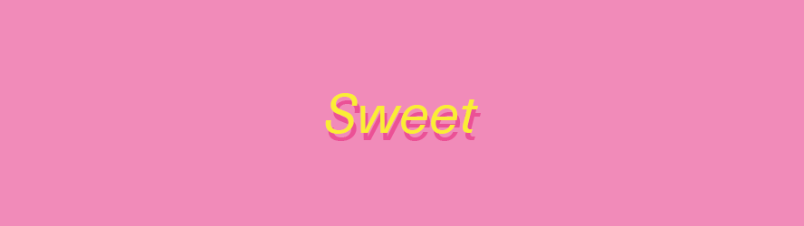

# Sweetercolor

A color extension library for Swift.

## Example

``` Swift
// Example of hex initializer
let sun = Sweetercolor(hex: 0xFBF002)
// Example of RGB 0-255 initializer
let pink = Sweetercolor(red: 243, green: 137, blue: 185)

let container = UIView(frame: CGRectMake(0, 0, 888, 250))
container.backgroundColor = pink.color

let label = UILabel(frame: container.frame)
label.text = "Sweet"
label.textColor = sun.color

// Example of overlay similar to Photoshop
label.layer.shadowColor = pink.overlayBlack.color.CGColor
```


## Documentation

Each method is documented using headerdocs. This is just an overview.

### Initialization

- Sweetercolor(color: UIColor)
- Sweetercolor(hex: Int, alpha: CGFloat = 1)
- Sweetercolor(red: CGFloat, green: CGFloat, blue: CGFloat, alpha: CGFloat = 1)
- Sweetercolor(hue: CGFloat, saturation: CGFloat, brightness: CGFloat, alpha: CGFloat = 1)

### Default Colors

Initialized similar to UIColor: Sweetercolor.colorName()

**Colors:** red, green, blue, cyan, yellow, magenta, orange, purple, brown, varsityBlue, black, gray, darkGray, lightGray, clear, white, random

## Variables & Methods

| Variable/Method | Description | Return Type |
|--------|-------------| -------|
| **color** | Get a UIColor | UIColor |
| **RGBA** | Get the red, green, blue and alpha values. | [CGFloat] |
| **humanRGBA** | Get the human readable red, green, blue and alpha values. | [CGFloat] |
| **HSBA** | Get the hue, saturation, brightness and alpha values. | [CGFloat] |
| **humanHSBA** | Get the human readable hue, saturation, brightness and alpha values. | [CGFloat] |
| **XYZ** | Get the CIE XYZ values. | [CGFloat] |
| **LAB** | Get the CIE L*ab values. | [CGFloat] |
| **luminance** | Get the relative luminosity value of the color. This follows the W3 specs of luminosity to give weight to colors which humans perceive more of. | CGFloat |
| **isDarkColor** | Determine if the color is dark based on the relative luminosity of the color. | Bool |
| **isLightColor** | Determine if the color is light based on the relative luminosity of the color. | Bool |
| **isDarkerThan(compareColor: Sweetercolor)** | Determine if this colors is darker than the compared color based on the relative luminosity of both colors. | Bool |
| **isLighterThan(compareColor: Sweetercolor)** | Determine if this colors is lighter than the compared color based on the relative luminosity of both colors. | Bool |
| **isBlackOrWhite** | Determine if this color is either black or white. | Bool |
| **CIEDE2000(compareColor: Sweetercolor)** | Detemine the distance between two colors based on the way humans perceive them. Uses the [Sharma 2004](http://www.ece.rochester.edu/~gsharma/ciede2000/ciede2000noteCRNA.pdf) alteration of the CIEDE2000 algorithm. | CGFloat |
| **CIE94(compareColor: Sweetercolor)** | Detemine the distance between two colors based on the way humans perceive them. Uses the CIE94 algorithm. |  CGFloat |
| **contrastRatio(compareColor: Sweetercolor)** | Determine the contrast ratio between two colors. A low ratio implies there is a smaller contrast between the two colors. A higher ratio implies there is a larger contrast between the two colors. |  CGFloat |
| **isContrastingColor(compareColor: Sweetercolor, strict: Bool = false)** | Determine if two colors are contrasting or not based on the W3 standard. | Bool |
| **fullContrastColor** | Get either black or white to contrast against a color. | Sweetercolor |
| **withAlpha(newAlpha: CGFloat)** | Get a clone of this color with a different alpha value. | Sweetercolor |
| **overlay(mask: Sweetercolor)** | Get a new color with a mask overlay blend mode on top of this color. This is similar to Photoshop's overlay blend mode. | Sweetercolor |
| **overlayBlack** | Get a new color if a black overlay was applied. | Sweetercolor |
| **overlayWhite** | Get a new color if a white overlay was applied. | Sweetercolor |
| **multiply(mask: Sweetercolor)** | Get a new color with a mask multiply blend mode on top of this color. This is similar to Photoshop's multiply blend mode. | Sweetercolor |
| **screen(mask: Sweetercolor)** | Get a new color with a mask screen blend mode on top of this color. This is similar to Photoshop's screen blend mode. | Sweetercolor |
| **complement** | Get the complement of this color on the hue wheel. | Sweetercolor |
| **splitComplement** | Get the split complements of this color on the hue wheel. | [Sweetercolor] |
| **analogous** | Get the analogous colors of this color on the hue wheel. | [Sweetercolor] |
| **triad** | Get the triad colors of this color on the hue wheel. | [Sweetercolor] |

## License

Feel free to do whatever you want. Please include the original header in any modifications or redistributions.

## Logo

The logo and name is based off of [Sweeterman by Ramriddlz](https://soundcloud.com/ramriddlz/sweeter-man). The original logo is based on the Chiquita logo.

------
August 2015 - Toronto
